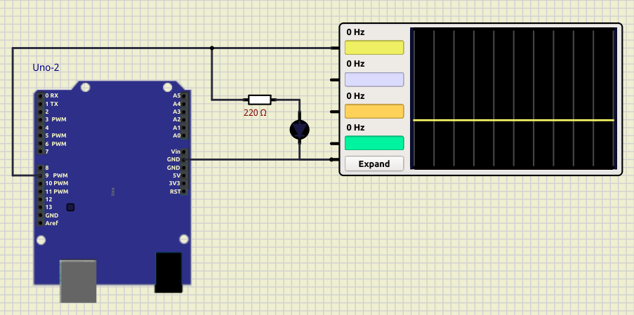

Fade blinking
==================

[SimulIDE project](02_blink_fade.sim1)

## Useful links

https://github.com/Rahix/avr-hal/issues/194
https://playground.arduino.cc/Main/TimerPWMCheatsheet/
https://www.robotshop.com/community/forum/t/arduino-101-timers-and-interrupts/13072 
https://gist.github.com/Wollw/2425784 
https://stackoverflow.com/questions/48873501/setting-up-arduino-uno-atmega328p-pwm-with-timer1 
