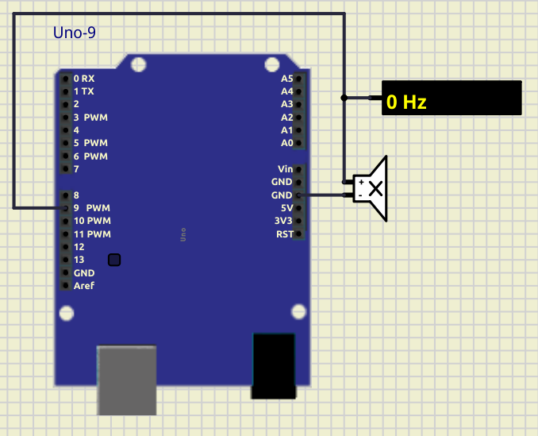

# Working with buzzer

Play musical tones from DO to SI. 

Uses Timer1 in the mode Clear Timer on Compare Match. Also enable Timer feature - toggle pin d3 on compare.

## SimulIDE scheme

[SimulIDE project](04_buzzer.sim1)

