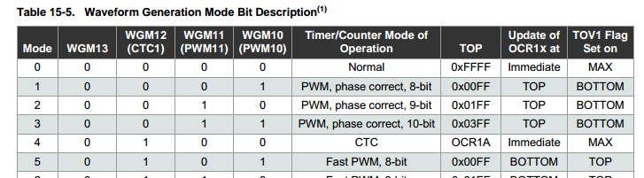

## Difference between original Amperka's solution

Original solution uses a cycle to detects button press (and uses pins 2 and 3, that strange).
This example uses external interrupts for processing a button's click.

## Fast PMW mode and lighting led
Common examples of PMW used Fast PWM mode. This mode has an issue on the extreme
values (see ATMega328P DATASHEET (7810-D-AVR-01/15), sections 14.7.3, 15.9.3, 17.7.3):

> The extreme values for the OCR0A register represents special cases when generating a PWM waveform output in the fast
PWM mode. If the OCR0A is set equal to BOTTOM, the output will be a narrow spike for each MAX+1 timer clock cycle.
Setting the OCR0A equal to MAX will result in a constantly high or low output (depending on the polarity of the output set by
the COM0A1:0 bits.)

Simplest way to resolve this issue is using Phase Correct PWM Mode (Mode 1 in the table 15-5) instead of
using Fast PWM Mode (Mode 5 in the table 15-5).


Example for timer1: 
```rust
    tc1.tccr1a.write(|w| w
        .wgm1().bits(0b01)
        .com1a().match_clear()
    );

    tc1.tccr1b.write(|w| w
        .wgm1().bits(0)
        .cs1().prescale_64()
    );
```

For more ways to resolve this issu e see this discussion: https://www.avrfreaks.net/forum/cant-turn-led-completelly-pwm